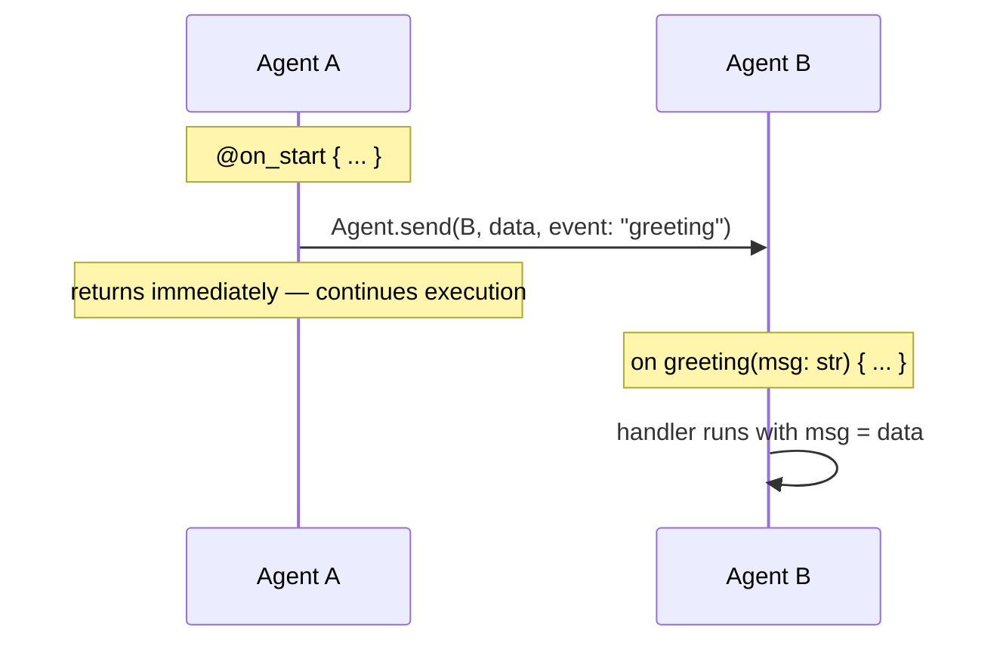
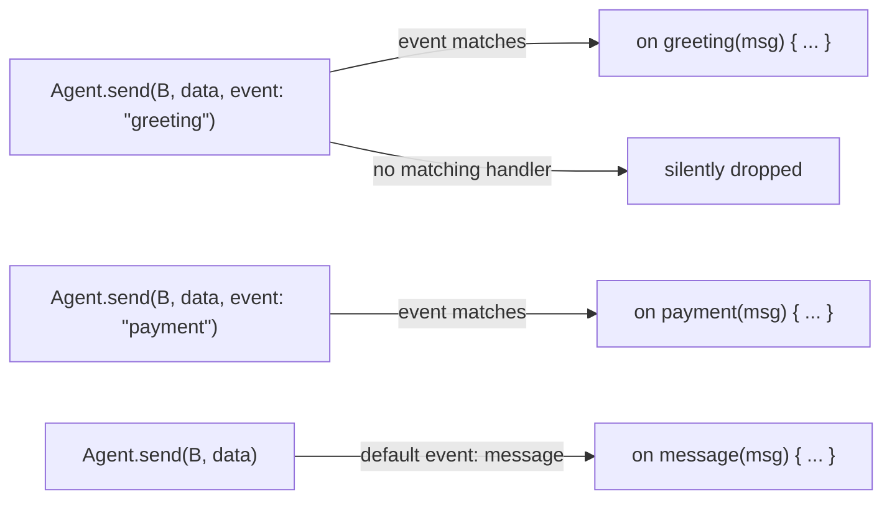
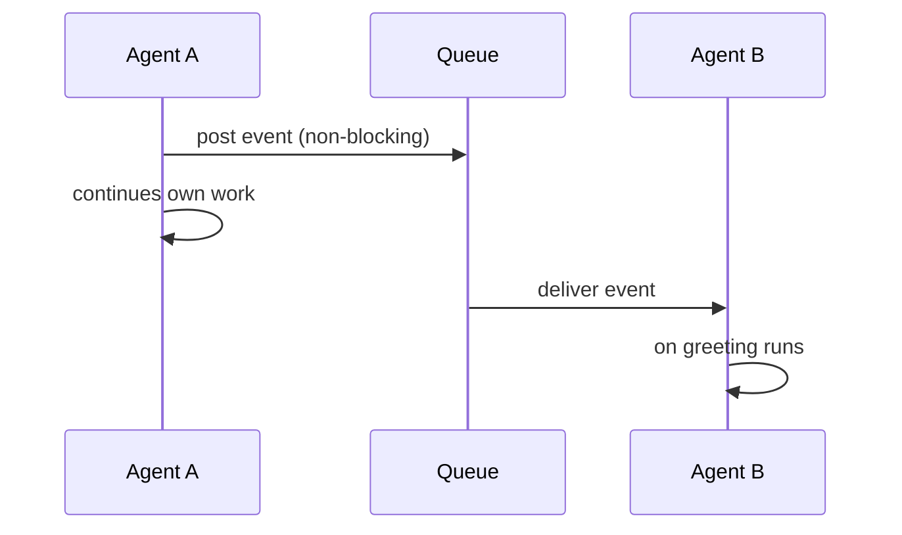
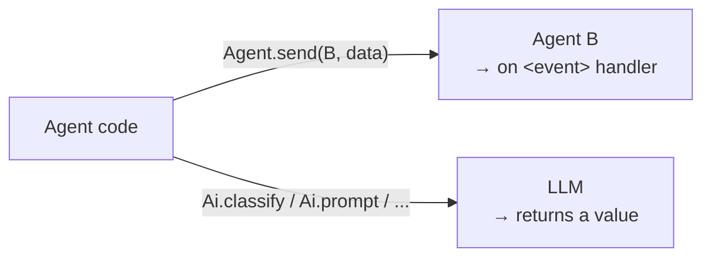
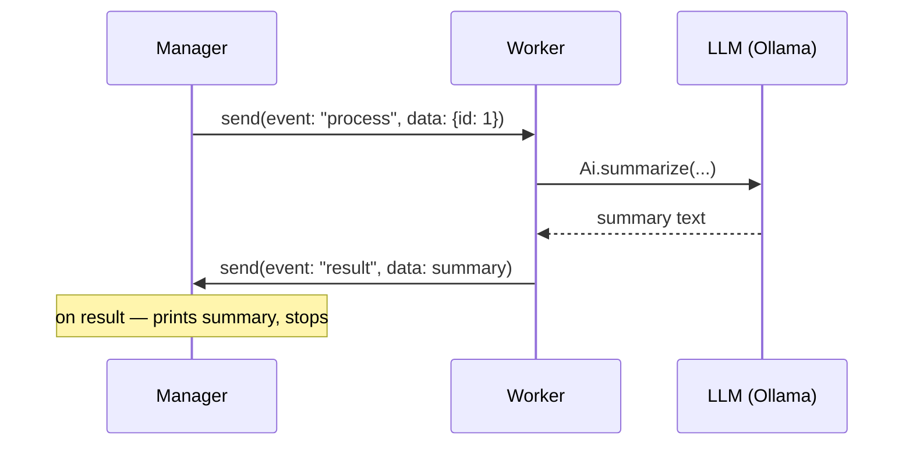

# Agent Communication

Keel agents communicate by sending **events** to each other. The sender
posts a named event and returns immediately. The receiver handles it when
the runtime delivers it.

## How It Works



## Event Routing

The `event:` parameter in `Agent.send` determines which `on` handler runs on the receiver.



The default event name is `"message"` — omitting `event:` routes to `on message`.

## Asynchronous Delivery

Send and receive are **decoupled**. Agent A does not wait for Agent B's handler to finish.



## Agent.delegate vs Agent.send

`Agent.delegate(target, task, args)` posts a **named task event** to another agent:

```keel
Agent.delegate(Processor, "handle", payload)
# Processor's `on handle` fires with payload
```

`Agent.send(target, data, event: "...")` posts a **data event** with explicit routing:

```keel
Agent.send(Processor, payload, event: "process")
# Processor's `on process` fires with payload
```

Both are non-blocking. Choose `delegate` when the receiver's task name is the event name; use `send` when you want more explicit control over the `event:` label.

Direct cross-agent calls such as `Worker.process(...)` are not part of the
agent model. Inside an agent, call agent-owned helpers as `self.task(...)`.
Across agents, use mailbox APIs so delivery remains explicit and asynchronous.

## Agent.send vs Ai.*

These are two completely separate communication paths.



`Agent.send` is agent-to-agent messaging — no LLM involved.
`Ai.*` calls send a prompt to the LLM and return its response.

## Example: Bi-directional Communication

```keel
agent Manager {
    state { done: int = 0 }

    @on_start {
        Agent.send(Worker, {id: 1}, event: "process")
    }

    on result(summary: str) {
        Io.show("Result received: {summary}")
        self.done = self.done + 1
        stop(Manager)
    }
}

agent Worker {
    on process(task: dynamic) {
        output = Ai.summarize(task.id, in: 1, unit: sentences)
        Agent.send(Manager, output, event: "result")
    }
}

run(Manager)
run(Worker)
```



## Broadcasting to a team

`Agent.broadcast(team, data, event: "...")` fans out a single event to
every live agent whose `@team [...]` attribute contains the target team
name. Agents on other teams stay silent.

```keel
agent Alpha {
    @team ["frontline"]
    on alert(msg: str) { Io.show("Alpha got {msg}") }
}

agent Beta {
    @team ["frontline"]
    on alert(msg: str) { Io.show("Beta got {msg}") }
}

agent Gamma {
    @team ["backoffice"]
    on alert(msg: str) { Io.show("Gamma got {msg}") }
}

agent Coordinator {
    @on_start {
        Agent.run(Alpha); Agent.run(Beta); Agent.run(Gamma)
        Agent.broadcast("frontline", "production-down", event: "alert")
        # Alpha and Beta fire; Gamma does not.
    }
}
```

`@team` accepts a list, so an agent can belong to multiple teams. The
broadcast is non-blocking — every recipient handles the event on its
own mailbox in its own time.

## Key Properties

| Property | Behaviour |
|----------|-----------|
| **Routing** | `event:` string in `Agent.send` matches the name in `on <event>` |
| **Default event** | Omitting `event:` routes to `on message` |
| **No match** | Unhandled events are silently dropped |
| **Send** | Non-blocking — sender continues immediately |
| **Execution** | Handlers run one at a time — no race conditions on `self.` |
| **Scope** | In-process only — no network, no serialization |

## See Also

- [Agents & Attributes](./agents.md)
- [Scheduling](./scheduling.md)
